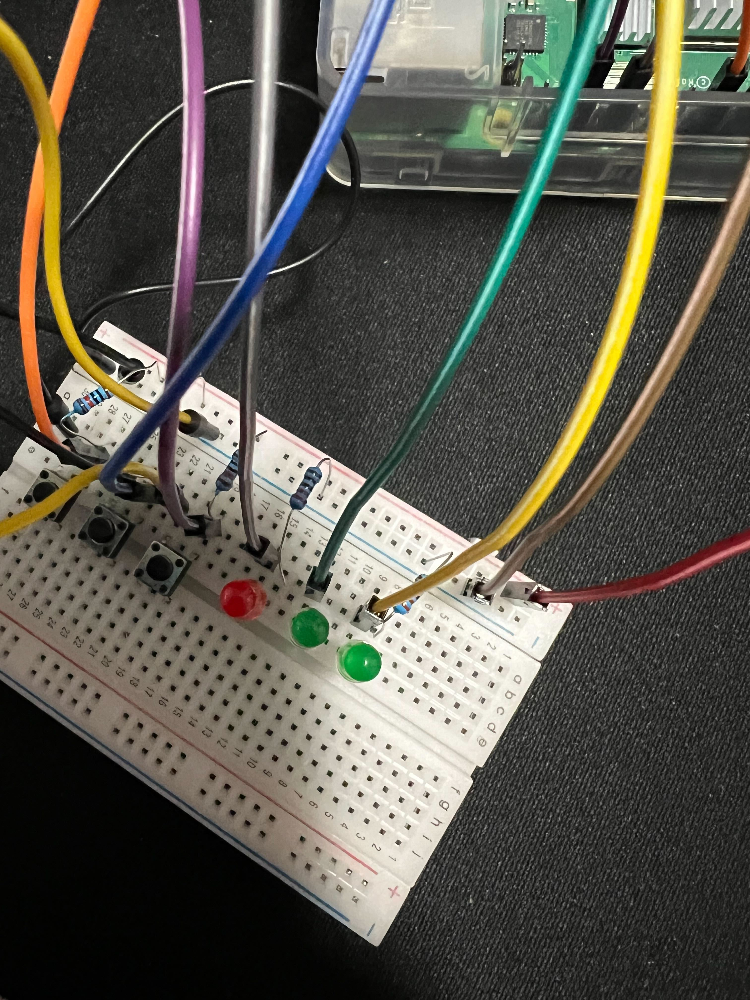
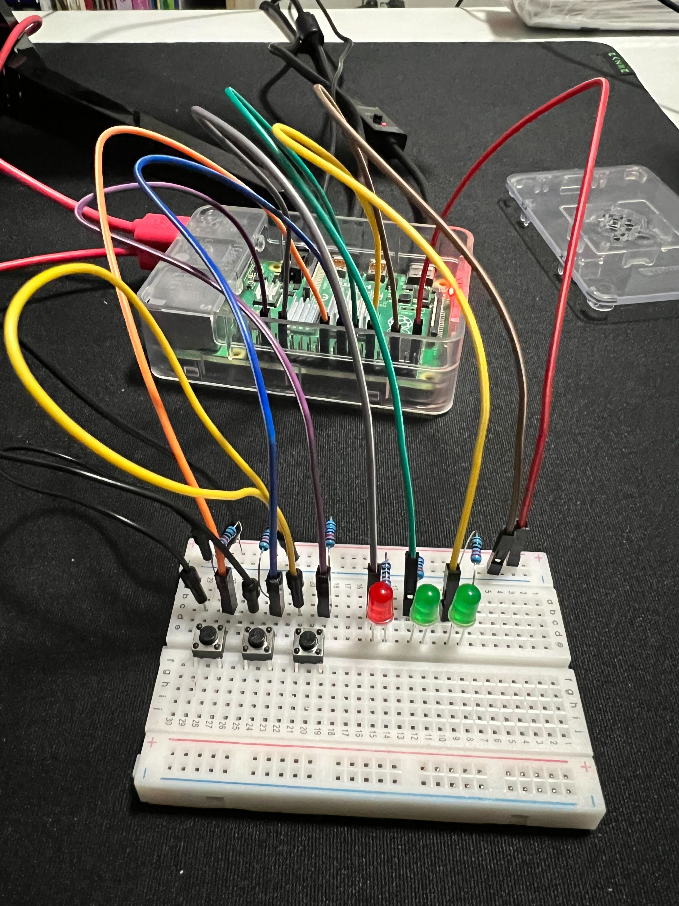
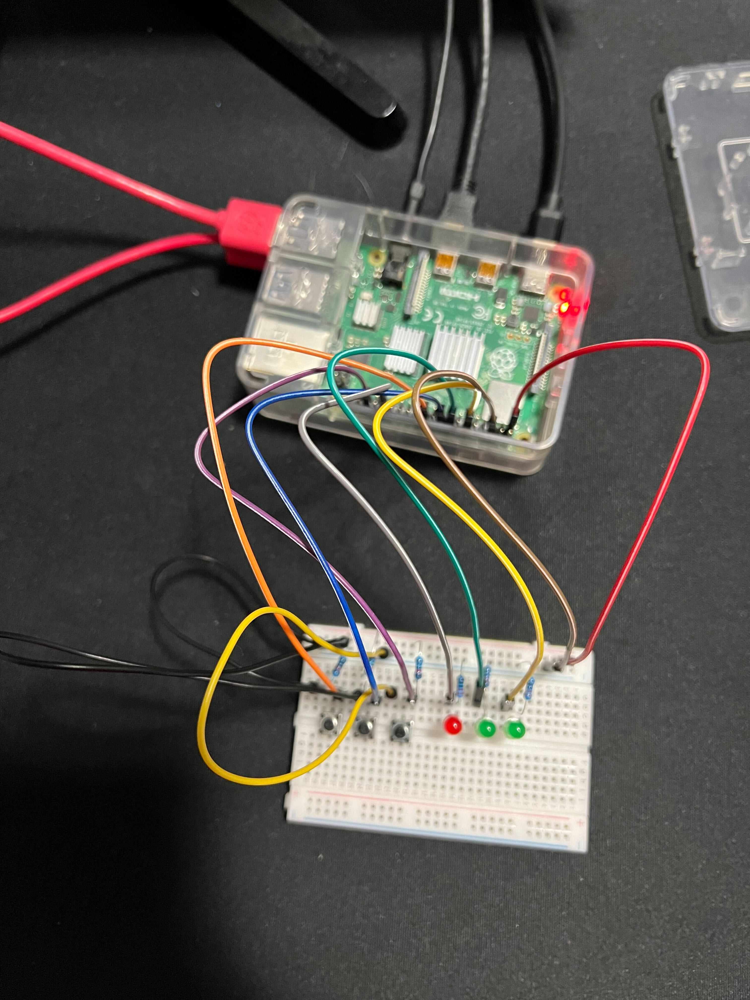
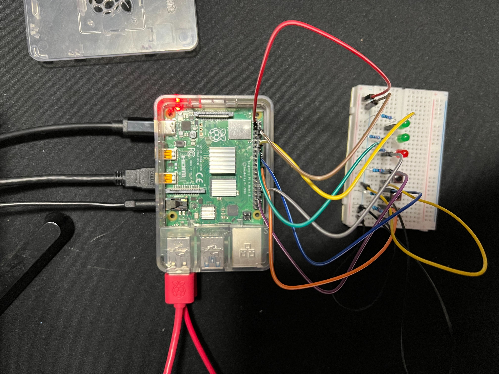
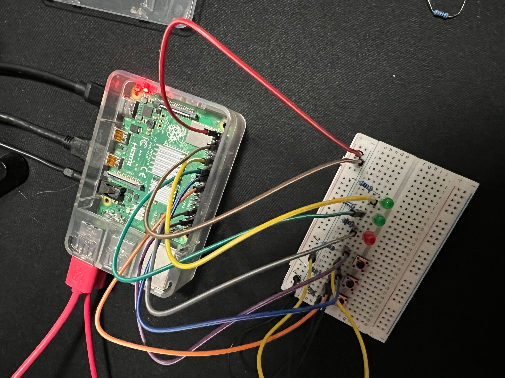
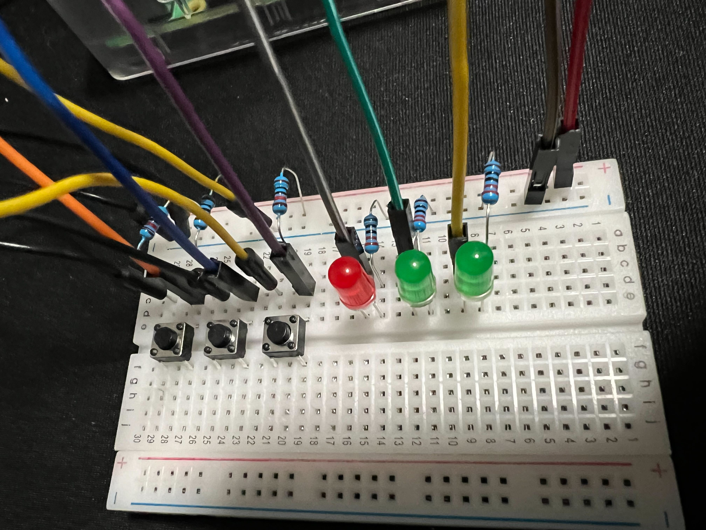
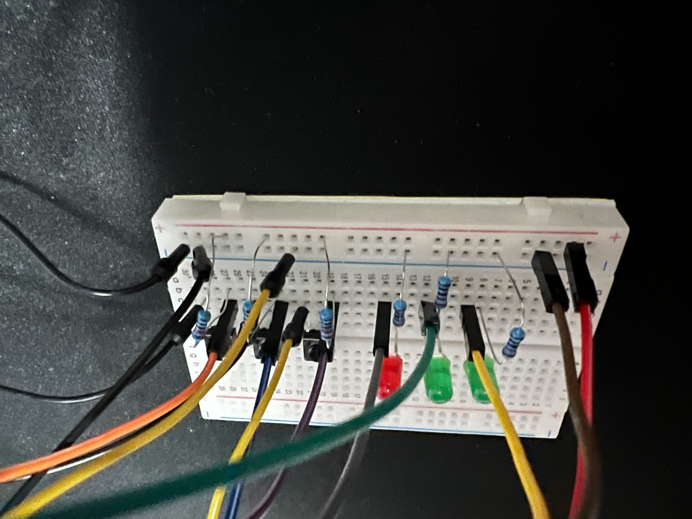
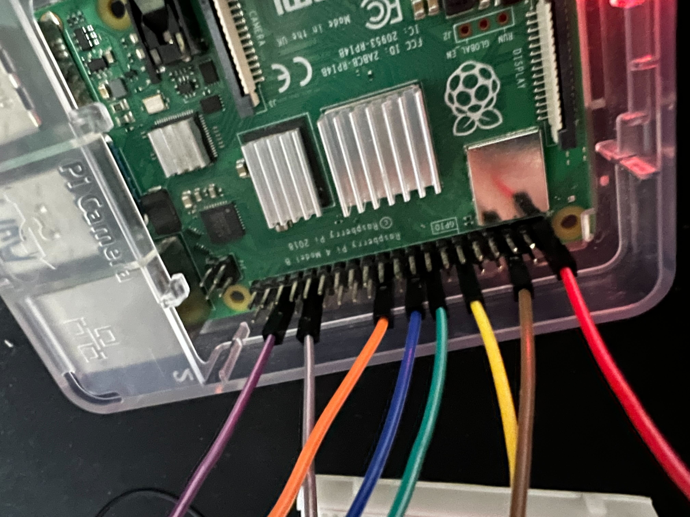

# Pi Camp 2023 Button Exercises

### Combined Tools

* 3x 10k ohm resistor
* 3x 220 ohm resistor 
* 1x breadboard
* 3x button
* 3x led 
* 8x jumper wires (male-to-female)
* 3x jumper wires (male-to-male)

>Hints
>
>Each Button:
>  * 10k ohm resistor
>  * jumper wire (male-to-female)
>  * jumper wire (male-to-male)
>
>Each Light:
>  * 220 ohm resistor
>  * jumper wire (male-to-female)
>

### Plan

* [button1](button1/) detect when a button is pressed
* [button2](button2/) toggle a light when a button is pressed
* [button3](button3/) toggle between 2 lights when a button is pressed
* [button4](button4/) toggle 2 lights with 2 buttons
* [button5](button5/) toggle 3 lights with 3 buttons
* [button6](button6/) guess a random sequence to win a game

### Pictures

