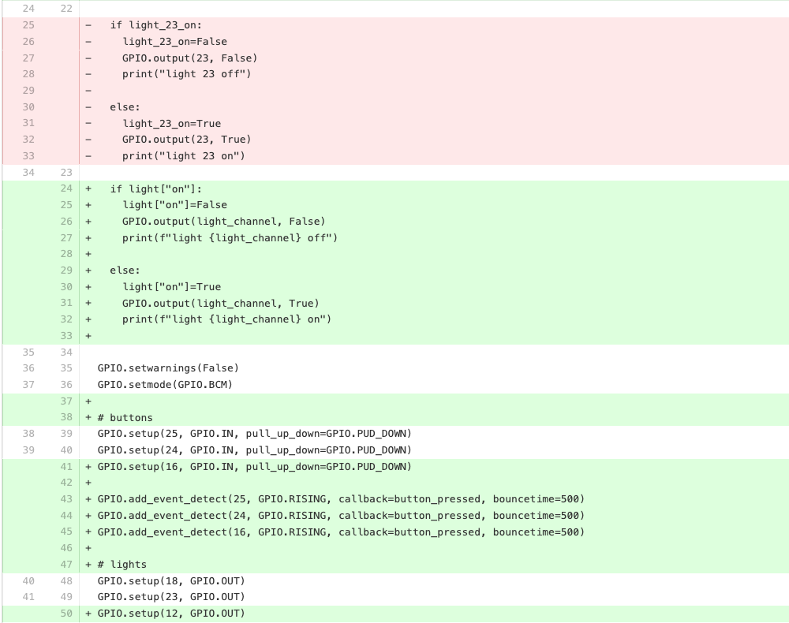

# Button Exercise 5

### Objective

1. toggle light 1 when button 1 is pressed
2. toggle light 2 when button 2 is pressed
3. toggle light 3 when button 3 is pressed

### New Tools

* 1x 10k ohm resistor
* 1x 220 ohm resistor
* 1x button
* 1x led
* 2x jumper wires (male-to-female)
* 1x jumper wire (male-to-male)

### Setup

### Sources

* https://www.canakit.com/Media/CanaKit-Raspberry-Pi-Quick-Start-Guide-4.0.pdf

